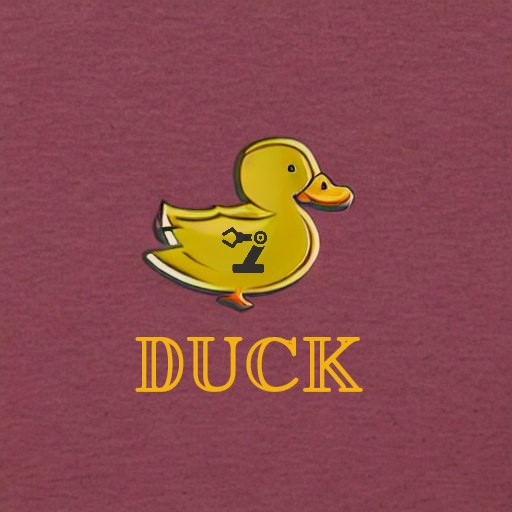

# DUCK (Daniel´s Universal Controllers for Kinematics)

  

This project is a intuitive and user-friendly approach to cartesian control for the UR robot arms. The aim of the project is to add visual servoing and pose control from scratch using Python as the main language.

To improve this project:
- Port to C++ (I am not going to do this for now, but would gladly allow anyone to do it and commit to this repository if they manage to do so - JD)

Current benchmarks:
- Average loop speed (launch): 0.0043s

WIP (QOL):
- Add dependencies file for python.
- Add setup script to auto-install and check dependencies.
- Add versions file.

WIP (Functionality):
- Add joint pose control for each joint. [Doable, but not necessary]
- Add self-collision avoidance. [DONE]
- Add manipulability maximizing controllers. [FOR 7R arms and above]*
- Add KDL support. [PENDING REVIEW]
